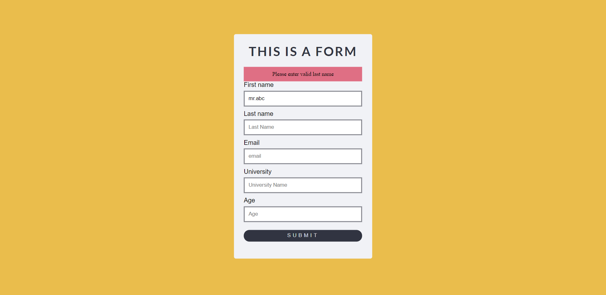
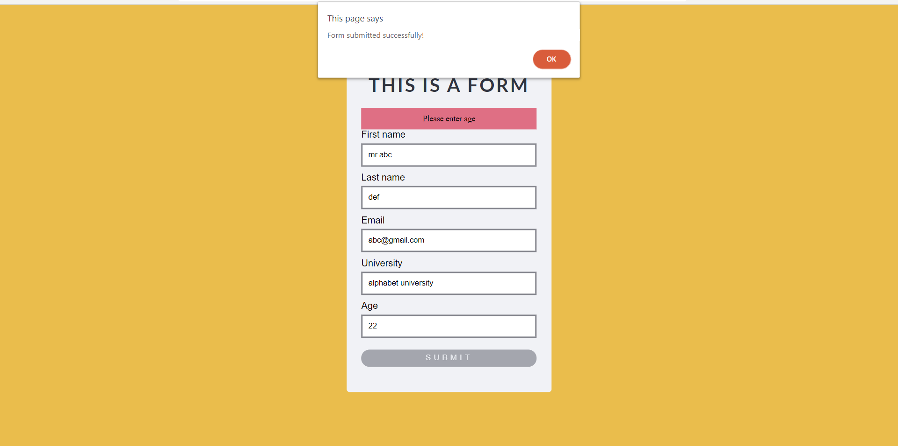

# *Form-validation with JavaScript*
---
 ### **Form Validation with JavaScript :**
 Sometimes we need to put a contact us form or any kind of form to interatct with customer so that we can gather some specific information about customer to provide them further information. So, we create some input section such as like :

 - First Name
 - Last Name
 - Email
 - Phone Number.
etc

Within these input section there are some specifin input method for example - Name section is only for letters where customer input their name , email section is only for emails where customer input their mail address not their phone number or name.  
To make sure customer fill them in correct method there is a validation way you can create , by doing that customer will get alert about their wrong input.  
There is a default way of HTML to make this validation.But JavaScript makes it even more interective to look at. Here is our form page :

  
  

This is our form with a Submit button. When we click on submit button our form will get tested for validation to make sure user input all the required element.

# Classes and id's
---
List of Classes & id's used here :  

### Class :
- container (for the whole form)
- heading (header of form)
- inner (for label and input only)
- ip (for input)
- lab (for label)
- btn (button div)

### id: 

- error (to target error message div with JavaScript)
- form1 ( to target Form)
- fName ( to target First name with javascript)
- lName ( to target Last name with javascript)
- uName ( to target University name with javascript)
- email ( to target email with javascript)
- age (to target age with javascript)

## error Message outCome

> error_FirstName
 >>   

>error_LastName
>>   

> error_email
>>   

> error_uniName  
>>   

> error_age
> >

## successful submission
> submitted Successfully
>> 

### Function validation()
        const validation = () => {
    let fName = document.getElementById('fName').value;
    let lName = document.getElementById('lName').value;
    let uName = document.getElementById("uName").value;
    let email = document.getElementById("email").value;
    let age = document.getElementById('age').value;
    let error = document.getElementById('error');
    let text;

    error.style.padding = '10px';

    if (fName.length < 3) {
        text = "Please enter valid first name"
        error.innerHTML = text;
        return false;
    }
    if (lName.length < 3) {
        text = "Please enter valid last name"
        error.innerHTML = text;
        return false;
    }
    if (email.indexOf('@') == -1 || email.length < 6) {
        text = "Please enter the valid mail"
        error.innerHTML = text;
        return false;
    }
    if (uName.length < 6) {
        text = "Please enter valid university name"
        error.innerHTML = text;
        return false;
    }
    if (age < 10) {
        text = "Please enter age "
        error.innerHTML = text;
        return false;
    }

    alert('Form submitted successfully!');
    return true
    }

       

